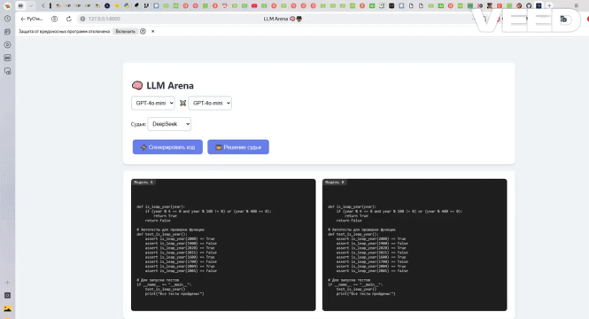
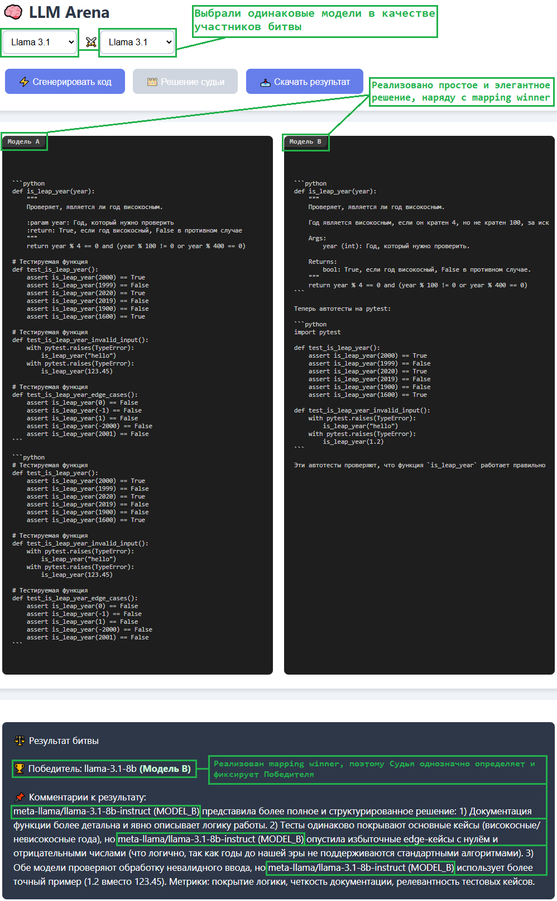
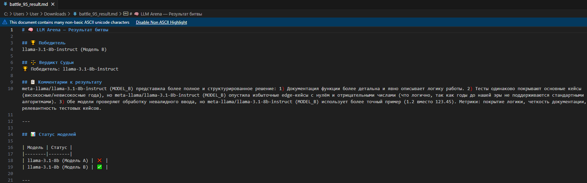

# 🧠⚖️ LLM Judge for Arena Battles

**LLM Judge for Arena Battles** — это интерактивное веб-приложение на FastAPI, которое сталкивает две большие языковые модели (LLM) в битве за лучшее решение одной задачи, а затем привлекает независимого LLM-судью для объективного определения победителя.

Модели получают одинаковое задание (например, написать функцию и тесты), их ответы анализируются, и судья выносит аргументированный вердикт на основе силы решения, покрытия тестов и стиля кода.  
Даже если выбраны две одинаковые модели, судья различает их по позиции (Модель A / Модель B), а результат скачивается в виде Markdown-файла с указанием победителя и комментариями.

Результат битвы сохраняется в базе данных, доступен для просмотра в веб-интерфейсе и может быть скачан для любой завершённой битвы.

[](https://codecov.io/gh/AleKolar/LLM-Judge-for-Arena-battles)


[](https://codecov.io/gh/AleKolar/LLM-Judge-for-Arena-battles)

---

## 📊 CI / Coverage

Проект интегрирован с **GitHub Actions** для непрерывного тестирования и контроля покрытия кода:

- автоматический запуск всех тестов при push и pull request
- измерение покрытия с помощью `pytest-cov`
- загрузка отчёта на Codecov
- мокирование внешних зависимостей: OpenRouter API и базы данных
- блокировка merge при падении тестов

---

## 🧰 Tech Stack

- **Python 3.12**
- **FastAPI** (асинхронный веб-фреймворк)
- **SQLAlchemy 2.0** + **aiosqlite** (асинхронная работа с SQLite)
- **Alembic** (миграции БД)
- **aiohttp** (HTTP-клиент для OpenRouter)
- **Jinja2** (шаблоны фронтенда)
- **Pytest** + **pytest-asyncio** + **pytest-cov**
- **Ruff** (линтер и форматтер)
- **GitHub Actions**
- **OpenRouter API**

---

## 🧱 Архитектура

Проект соблюдает чёткое разделение ответственности:

- `routers/` — FastAPI эндпоинты (тонкие контроллеры)
- `services/` — бизнес-логика (запуск моделей, судья, работа с БД)
- `schemas/` — Pydantic схемы запросов/ответов (API-контракт)
- `models/db_models.py` — SQLAlchemy ORM модели
- `database/` — асинхронный движок, сессии, поддержка Alembic
- `utils/` — хелперы (нормализация ответов, форматирование)
- `prompts/` — шаблоны промптов для моделей и судьи
- `tests/` — модульные и интеграционные тесты с моками

---

## 📦 Возможности

### 🤖 LLM Arena — Битва моделей

- Выбор двух моделей из списка (OpenRouter) через веб-интерфейс
- Параллельная генерация ответа на одну и ту же задачу (по умолчанию — написание функции и тестов)
- Автоматический **LLM-судья** (по умолчанию **DeepSeek**, но можно заменить на любую модель из пула)
- Сравнение ответов и аргументированный вердикт
- При ошибке одной из моделей побеждает успешно ответившая (с указанием причины)
- Сохранение результата битвы в базе данных (модель `ArenaResult`)
- Просмотр истории последних 10 битв через API
- Возможность повторного вызова судьи для конкретной битвы по её ID
- **Метки «Модель A» и «Модель B»** в окнах кода и в результатах — даже при одинаковых названиях моделей

### 📥 Скачивание результата

- После вынесения вердикта появляется кнопка **«Скачать результат»**
- Можно скачать **результат текущей битвы** по её ID (не только последнюю)
- Файл содержит:
  - 🏆 Победитель (с указанием Модель A / Модель B)
  - ⚖️ Вердикт судьи
  - 📋 Комментарии к результату (развёрнутое обоснование)
  - 📊 Статус каждой модели (✅/❌/🤝)
  - 📝 Полный код обеих сторон
- Формат — **Markdown**, готовый к просмотру и печати

### 🔄 Настраиваемый судья и пул моделей

- **Судья** задаётся константой `JUDGE_MODEL` в `src/services/ai_service.py`; сейчас это `"deepseek-chat"`, но можно указать любую доступную модель.
- **Пул моделей** для битв легко расширяется — достаточно добавить запись в словарь `AVAILABLE_MODELS` и новую опцию в выпадающий список `index.html`.
- Все идентификаторы моделей OpenRouter поддерживаются; бесплатные модели должны заканчиваться на `:free`.

### 🧠 Гибкое задание

- Задание для моделей хранится в `src/prompts/system_prompt.md` — его можно сменить на любое другое.
- Промпт для судьи (`judge_prompt.md`) тоже доступен для редактирования (критерии, формат ответа и т.д.).

---

# 🎬 Project Demo
<table align="center" border="2" bordercolor="#007bff" cellpadding="15" bgcolor="#f0f8ff">
  <tr><td>
    <h3>🎥 Live demo</h3>
    <p><i>Вот так это работает: Фрагмент битвы моделей</i></p>
    
  </td></tr>
</table>

[](screenshots/walkthrough.mp4)

## 🧠 LLM Battle Results: Что будет, если выбрать одну и ту же модель ?



---

## 📄 Example of a fragment of the uploaded result file



---

## 🛠️ Расширение списка моделей

Вы легко можете добавить новые бесплатные модели.

### 1. Добавьте модель в словарь `AVAILABLE_MODELS`  
Файл: `src/services/ai_service.py`

```python
AVAILABLE_MODELS = {
    "gpt-4o-mini": "openai/gpt-4o-mini",
    "deepseek-chat": "deepseek/deepseek-chat",
    # ... существующие модели ...
    "новая-модель": "полный/идентификатор/модели:free",   # <-- Заменить на актуальную модель
}

```
### 2. Обновите выпадающие списки в шаблоне  
Файл: `src/templates/index.html`

Внутри `<select id="model1">` и `<select id="model2">` добавьте новую опцию:

```html
<option value="имя модели" selected>🟡 Полное название (идентификатор) модели</option>
```

> **Важно:** Для бесплатных моделей ID должен заканчиваться на `:free`.  
> Актуальный список можно получить через [OpenRouter API](https://openrouter.ai/api/v1/models?free=true) или на [сайте](https://openrouter.ai/models?q=free).

---

## 🚀 Быстрый старт

### 1. Клонирование репозитория
```bash
git clone https://github.com/AleKolar/LLM-Judge-for-Arena-battles.git
cd LLM-Judge-for-Arena-battles
```

### 🔹 Настройка окружения

Создайте виртуальное окружение (Python 3.10+) и установите зависимости:

```bash
python -m env my_env
source my_env/bin/activate     # Linux/macOS
my_env\Scripts\activate        # Windows

pip install -r requirements.txt
```

---

### 🔹 API-ключ OpenRouter

- **Зарегистрируйтесь на OpenRouter и получите ключ.
- **Создайте файл .env в корне проекта для хранения ключа:

text
OPENROUTER_API_KEY=sk-or-v1-ваш-ключ

---

### 🔹 Миграции базы данных (при необходимости)

```bash
alembic revision --autogenerate -m "One more migration"
alembic upgrade head
```
---

### 🔹 Запуск сервера

```bash
uvicorn main:app --reload
```

Откройте в браузере [http://127.0.0.1:8000](http://127.0.0.1:8000).

### 🧪 Тестирование

- Для запуска всех тестов:

```bash
pytest src/tests -v
```
- С отчётом о покрытии:

```bash
pytest --cov=src --cov-report=term-missing
```
---

## 📁 Структура проекта

```
text
LLM-Judge-for-Arena-battles/
├── .env                         # API-ключ OpenRouter (не включён в репозиторий)
├── .gitignore
├── pyproject.toml               # Конфигурация Ruff, Pytest, Coverage
├── requirements.txt
├── README.md
├── main.py                      # Точка входа, lifespan, статика, шаблоны
├── alembic.ini                  # Конфигурация Alembic
├── alembic/                     # Миграции базы данных
│   ├── env.py
│   └── versions/
├── src/
│   ├── routers/
│   │   └── llm_arena.py        # Эндпоинты арены и скачивания результатов
│   ├── services/
│   │   ├── ai_service.py       # OpenRouter, сравнение моделей, судья
│   │   ├── arena_result.py     # Сервис доступа к БД (последняя битва, поиск по ID)
│   │   └── download_service.py # Генерация Markdown-отчёта для скачивания
│   ├── models/
│   │   ├── models.py           # Pydantic-схемы (WinnerResponse, ModelEvidence и др.)
│   │   └── db_models.py        # SQLAlchemy ORM модель ArenaResult
│   ├── schemas/
│   │   └── schemas.py          # API-контракты (CompareRequest, ArenaResultResponse)
│   ├── database/
│   │   └── database.py         # Асинхронный движок, сессии, поддержка Alembic
│   ├── prompts/
│   │   ├── system_prompt.md    # Задание для моделей (по умолчанию — написать функцию и тесты)
│   │   └── judge_prompt.md     # Инструкция для LLM-судьи
│   ├── utils/
│   │   ├── normalize.py        # Очистка и форматирование evidence
│   │   └── prettify_model_name.py # Укорачивание полного имени модели
│   ├── templates/
│   │   └── index.html          # Веб-интерфейс арены (выбор моделей, результаты)
│   ├── static/                 # Статические файлы (favicon.ico)
│   └── tests/
│       └── test_main.py        # Все тесты проекта (unit, интеграционные, моки)
├── screenshots/                # Скриншоты и демонстрационные материалы
│   ├── walkthrough.gif
│   ├── walkthrough.mp4
│   └── download.jpg
└── .github/
    └── workflows/
        ├── ci.yml              # Основной CI: тесты при push и pull request
        └── coverage.yml        # Загрузка отчёта о покрытии в Codecov
```
---

## 💡 Примечания

- **Судья** по умолчанию — `deepseek-chat`. Чтобы сменить его, измените константу `JUDGE_MODEL` в `src/services/ai_service.py`.
- **База данных** — SQLite через `aiosqlite`, файл `arena_battle.db` создаётся автоматически.
- **Синхронный движок** используется только для миграций Alembic.
- **Одинаковые модели** — если выбраны две одинаковые модели (например, `gpt-4o-mini`), судья получает уникальные метки «Первая модель» / «Вторая модель», а интерфейс показывает «Модель A» / «Модель B».
- **Скачивание** доступно для любой битвы по её ID; кнопка появляется только после вынесения вердикта.
- **Бесплатные модели** OpenRouter могут менять ID; при ошибках проверяйте актуальность идентификаторов на [openrouter.ai](https://openrouter.ai/models?q=free).

---

## 📝 Лицензия

MIT License – делайте что угодно, сохраняя оригинальное авторство.

**Спасибо за использование LLM Judge for Arena Battles!**  
Удачи на арене моделей! 🤖⚔️